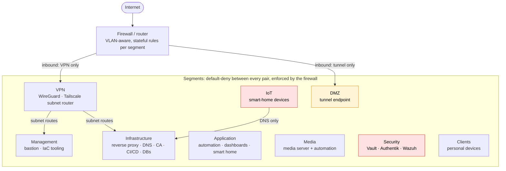

# 🏠 Homelab — Infrastructure as Code, Zero-Trust Network, Self-Hosted Everything

> A production-style homelab built to practice and demonstrate real infrastructure engineering: Infrastructure as Code, centralized secrets management, single sign-on, network segmentation, SIEM/security monitoring, and tested disaster recovery — not just "a pile of Docker containers."

The Terraform/Ansible source for this lab is kept in a private repository (it contains real network topology and is not for public sharing) — this README documents the architecture, design decisions, and the engineering practices behind it.

Sanitized versions of the core patterns are in [`examples/`](examples/): the JSON-driven Terraform LXC module and the idempotent Vault "get-or-create" Ansible role. They and the ESPHome device config are checked by [CI](.github/workflows/ci.yml) on every push.

---

## 🧰 Skills & Technologies

**IaC / Automation:** Terraform · Ansible · Git · CI/CD
**Virtualization:** Proxmox VE · LXC · KVM/VM management
**Networking:** VLAN segmentation · Firewall/ACL design · VPN (WireGuard) · DNS · Internal PKI/ACME
**Security:** Secrets management (Vault) · SSO/OIDC · SIEM/XDR (Wazuh) · Zero-trust network design
**Observability:** Prometheus · Grafana · Loki · Zabbix · Alerting design · Hardware health monitoring
**Systems:** Linux administration · Time sync/NTP · DHCP/IPAM · Reverse proxying
**Other:** Backup/disaster-recovery engineering · Home automation (Home Assistant, ESPHome) · AI-assisted operations

---

## 📋 Table of Contents

- [Philosophy](#-philosophy)
- [Architecture Overview](#-architecture-overview)
- [Infrastructure as Code](#-infrastructure-as-code)
- [Secrets Management](#-secrets-management)
- [Single Sign-On](#-single-sign-on)
- [Network Segmentation](#-network-segmentation)
- [Internal PKI & Reverse Proxy](#-internal-pki--reverse-proxy)
- [Monitoring, Logging & SIEM](#-monitoring-logging--siem)
- [AI-Assisted Fleet Maintenance](#-ai-assisted-fleet-maintenance)
- [Backup & Disaster Recovery](#-backup--disaster-recovery)
- [Services Catalog](#-services-catalog)
- [Smart Home](#-smart-home)
- [Engineering Highlights / War Stories](#-engineering-highlights--war-stories)
- [Roadmap](#-roadmap)
- [About Me](#-about-me)

---

## 🎯 Philosophy

Every service here is deployed the same, repeatable way — nothing is hand-clicked into existence. The goals driving every design decision:

- **Everything is code.** New services get a Terraform LXC definition + an Ansible role, not a manual container spin-up.
- **Nothing is a shared secret sitting in a config file.** Every credential is generated on first deploy and lives in a central secrets manager, never hardcoded, never committed.
- **One identity, everywhere.** A single SSO login federates into every service that supports it, instead of a different password per app.
- **The network enforces the trust model, not just the apps.** VLANs + firewall rules mean a compromised IoT device physically cannot reach the secrets manager, even if every app-level auth check somehow failed.
- **If it can't be restored from nothing, it's not actually backed up.** The disaster recovery procedure has been written and dry-run tested end-to-end, not just assumed to work.

---

## 🗺️ Architecture Overview

Cross-VLAN traffic is default-deny; every exception is an explicit, documented pass rule. The arrows show the only inbound paths and the exceptions described in this README; the diagram doesn't list every rule. Red segments are the most tightly locked down; amber is internet-facing.

**Hypervisor:** Proxmox VE, single physical host, LXC-first (containers for every Linux service; a couple of true VMs only where required — router/firewall, smart-home OS, NAS).

**Storage:** A dedicated NAS VM running ZFS in RAIDZ2, serving both media storage and NFS-backed storage for some containers' root disks.

---

## 🧱 Infrastructure as Code

- **Terraform** (`bpg/proxmox` provider) drives every LXC's existence — a single JSON file defines each container's VLAN, IP, resources, and storage backend; a `for_each` loop turns that into real infrastructure. Adding a new service is: add one JSON entry, write one Ansible role, `terraform apply`.
- **Terraform state** is stored in Postgres (not local files), so infrastructure changes are safe even with the tooling itself running from a container that could be rebuilt.
- **Ansible** owns everything past "the container exists" — package installs, service config, reverse-proxy site blocks, DNS records, and the secrets-generation dance described below. Roles follow a strict idempotent pattern: check if a secret exists first, generate only if missing, never regenerate and break an existing integration. See the [sanitized example](examples/README.md).

---

## 🔑 Secrets Management

**HashiCorp Vault** is the single source of truth for every credential in the lab. The pattern used everywhere:

1. Ansible checks Vault for an existing secret at a known path.
2. If found, reuse it (idempotent — re-running a playbook never rotates a working credential out from under a live integration).
3. If not found, generate a fresh random one, write it to Vault, and use it.

This means: no password is ever typed into a YAML file, no API key lives in `docker-compose.yml`, and a full credential audit is one `vault kv list` away.

Vault itself is backed up via its integrated Raft snapshot mechanism — restoring it correctly (and understanding *why* the original unseal keys, not new ones, are required after a restore) is documented as its own disaster-recovery runbook.

---

## 🔐 Single Sign-On

**Authentik** provides SSO across nearly the entire service catalog, via two mechanisms depending on what each app actually supports:

- **Native OIDC** for the handful of apps that implement it themselves (git hosting, dashboards, monitoring, wiki, secrets manager UI, IPAM). Getting this working consistently surfaced real integration quirks — mismatched scope requests, apps that silently drop non-explicit `grant_types`, GraphQL mutations that delete-and-recreate config instead of patching it — all captured as reusable Ansible task patterns rather than one-off hacks.
- **Forward-auth at the reverse proxy** for everything else (media stack, automation tools, dashboards, monitoring UIs with no OIDC of their own) — the reverse proxy checks with Authentik's outpost before forwarding any request, so an app never needs to support SSO itself to get gated by it. A couple of services are deliberately left out of this (anything needing simple local-network trusted access, or already authenticating through another already-SSO'd service) rather than applying it blindly everywhere.

---

## 🌐 Network Segmentation

Nine purpose-built VLANs (management, infrastructure, applications, media, security, clients, IoT, VPN, DMZ), enforced by explicit firewall rules rather than a flat "trusted LAN." Default posture is deny-by-default between segments, with narrow, documented exceptions (e.g., the monitoring segment is allowed to scrape metrics from other segments on exactly the ports it needs, nothing else).

Key design decisions:
- The secrets manager and SSO provider live on the most restricted segment — reachable by almost nothing except what explicitly needs them.
- A dedicated VPN gateway (WireGuard) provides remote access without exposing anything else directly to the internet, alongside a second, independent VPN path (a Tailscale subnet router) for reaching the management/infrastructure segments both remotely and from a local workstation that's normally firewalled away from them.
- The one thing that *is* internet-facing (a tunnel endpoint for selective external access) sits alone in its own DMZ segment.

---

## 🔏 Internal PKI & Reverse Proxy

A private internal CA (step-ca) issues real, trusted TLS certificates to every internal service via ACME — every internal hostname gets automatic HTTPS with no self-signed-cert browser warnings, because every host in the fleet trusts the internal root CA. **Caddy** handles reverse proxying and automatic cert renewal for the whole service catalog from one place.

---

## 📊 Monitoring, Logging & SIEM

- **Prometheus + Grafana** — full-fleet metrics, including the hypervisor itself, with a single "fleet overview" dashboard and per-host drill-down.
- **Loki** — centralized log aggregation.
- **Wazuh** — SIEM/XDR with an agent on every single host in the fleet (management host included), giving full security-event visibility and vulnerability tracking across the whole environment, not just the "important" servers.
- **Hardware health, not just service health** — SMART data from the hypervisor's physical disks and pool/array health from the NAS (which has no shell access at all — pulled via its management API instead) both feed the same Grafana instance, with multi-stage alert rules (raw metric → reduced value → threshold) so a slowly-degrading disk pages someone the same way a crashed container would.
- **A second, independent monitoring stack (Zabbix)** specifically covering the systems the primary stack can't reach cleanly: the firewall/router and the NAS (both via native SNMP, not a bolted-on exporter) and the hypervisor itself. Deliberately additive, not a replacement — a genuinely different perspective on the same fleet, with its own alerting model (event-driven triggers rather than metric-threshold rules), so a blind spot or bug in one stack doesn't leave the whole lab unmonitored.

---

## 🤖 AI-Assisted Fleet Maintenance

Three headless AI agents run on a schedule against the live monitoring stack (metrics, logs, uptime checks, SIEM) with real but tightly bounded authority — no human approves each individual action, but a strict tiered policy defines exactly what "safely fixable" means:

- **Auto-fixable** (restart a crashed service, clear known-safe disk space) — just done, verified, logged.
- **Reversible-with-care** (a config change) — snapshot first, apply, verify, roll back automatically if verification fails.
- **Detect-only, never act** — an explicit, non-negotiable list (the secrets manager, any firewall change, storage-pool mutations, anything destructive) that always gets reported to a human instead of touched.

A fast, narrow daytime pass (metrics/uptime/SIEM/smart-home device health only) runs a couple of times a day; a deeper nightly pass has the full toolset and a longer window. A third agent handles patching on its own dedicated nights — it refuses to touch anything until it's confirmed the fleet is actually healthy first, applies a capped, prioritized batch rather than everything at once, and queues the rest for its next scheduled run instead of rushing. The two "check fleet health" agents and the "apply updates" agent are mutually exclusive by design — patch nights are handled deterministically, not by racing for a lock, so it's always predictable which one runs when. All of them report a single, clear summary over chat when done — not a wall of green checkmarks, and never silent about something still unresolved from a prior run.

Unresolved findings are tracked as real issues in the self-hosted Git server rather than only ever existing as chat scrollback — each agent has its own dedicated account (so authorship is real, not a shared generic identity), searches for an existing issue before opening a duplicate, and follows a deliberate closing rule: an apparent fix gets flagged and watched for a few days before the issue is actually closed, not closed the moment it first looks resolved (a fix that regresses a day later resets the clock rather than silently reopening something already marked done). Agents can also hand an issue to a different agent when its schedule or capabilities fit the follow-up better, and — when an agent hits a genuine decision only a human should make — it opens a self-assigned question and waits for a reply in that same thread, rather than blocking silently or guessing.

---

## 💾 Backup & Disaster Recovery

The backup strategy deliberately does **not** back up everything — infrastructure that Terraform/Ansible can faithfully recreate isn't backed up at all; only genuine, non-recreatable *data* is (secrets manager contents, internal CA keys, application databases, git repositories, workflow/automation state, smart-home configuration).

- **restic**, encrypting client-side before anything leaves the network, deduplicating across runs, with a daily/weekly/monthly retention policy.
- A second, independent encryption layer (age) on top of the single highest-value bundle (secrets manager + CA keys) — so a compromised backup-tool password alone still isn't enough to read the most sensitive material.
- Offsite target, reached via `rclone`, kept separate from on-site NAS backups.
- A **fully written, dry-run-tested disaster recovery runbook** — not just "we have backups," but a step-by-step procedure that assumes the reader has zero prior context, was actually exercised (including catching and documenting a couple of genuine gotchas around stale locks and orphaned backup data along the way).
- A second, complementary **local snapshot backup** (VM/container disk images, not just data) direct to on-site NAS storage — fast local recovery for the common case, kept separate from and secondary to the offsite pipeline above, deliberately excluding workloads that already source their data from the same NAS to avoid a pointless backup-to-itself loop.

---

## 🛠️ Services Catalog

| Category | Services |
|---|---|
| **Identity & Secrets** | Vault, Authentik |
| **Networking** | Internal CA (step-ca), reverse proxy (Caddy), DNS/ad-blocking (Pi-hole), WireGuard VPN |
| **CI/CD & Source Control** | Self-hosted Git, CI server |
| **Observability** | Prometheus, Grafana, Loki, Wazuh SIEM |
| **IPAM/DCIM** | NetBox |
| **Documentation** | Self-hosted wiki |
| **Media** | Media server (hardware-accelerated transcoding), automated media management/acquisition stack, subtitle automation with multi-provider + multi-language support |
| **Home Automation** | Home Assistant, WLED, ESPHome, Zigbee2MQTT, various local + cloud device integrations |
| **Productivity** | Workflow automation, home inventory tracker, unified service dashboard, recipe manager, Discord bot integrations, self-hosted RSS/video aggregator with AI-scored relevance filtering and an AI-generated daily digest, AI-assisted job-market matching tool that scores postings against a candidate profile and surfaces recurring skill-gap trends |

---

## 🏡 Smart Home

Home Assistant integrates a mix of local-only (ESPHome, Zigbee2MQTT, WLED) and cloud-dependent (a couple of manufacturer ecosystems that don't offer a local API) devices. Automations include presence-based lighting, TV-power-synced ambient lighting, air-quality-triggered purifier control, and a DIY ESPHome-based motorized blind controller with full position calibration and power-loss recovery (see `esphome/blinds-bedroom` in this repo).

---

## 💡 Engineering Highlights / War Stories

Real incidents this lab has hit and resolved. Each is written up in full in [`docs/war-stories/`](docs/war-stories/README.md) as **Symptom → Investigation → Root cause → Fix → Lesson**.

**Start with these:**
- **[Multi-drive NAS pool failure cascade](docs/war-stories/nas-pool-failure-cascade.md)**: a failing drive's bus noise made a healthy neighbour look like a second failure. Rebuilt the pool for reliability over capacity and moved the hottest workloads off shared storage.
- **[Media-server freezes caused by five other services](docs/war-stories/cross-service-disk-contention.md)**: five services' unpruned history quietly saturated weak SSDs. Found by ranking containers by disk reads; fixed each at its source.
- **[Three distinct bugs behind one "timeout" symptom](docs/war-stories/ai-gateway-three-bugs.md)**: quota counted on acceptance, mismatched timeouts, and an in-memory timer that survived reconfiguration.
- **[A wall of identical "load too high" alerts](docs/war-stories/container-load-average-false-alarms.md)**: LXC containers report the hypervisor's load average, not their own. Fixed the checks instead of raising thresholds.

**More:**
- [Management-network outage during a VLAN migration](docs/war-stories/management-network-outage.md): bond → link → ARP cross-reference instead of reboots
- [A WireGuard peer whose replies vanished](docs/war-stories/wireguard-nat-gap.md): a packet capture separated "never arrives" from "no route back"
- [Proving a second VPN path actually works](docs/war-stories/subnet-router-differential-test.md): a test that could fail, against a segment that should be blocked
- [Migrating the smart-home fleet onto its own IoT VLAN](docs/war-stories/iot-vlan-migration.md): devices got new local keys on rejoin
- [Designing patch automation that respects IaC](docs/war-stories/iac-drift-aware-patching.md): pinned versions must be patched in code, not just live
- [An automation bug hidden by a lenient error handler](docs/war-stories/masked-automation-bug.md)
- [A silently ignored API filter during a forward-auth rollout](docs/war-stories/forward-auth-api-filter.md)
- [A fleet-wide NTP change that silently did nothing](docs/war-stories/ntp-silent-no-op.md): containers share the host clock
- [A third-party Docker image with a broken dependency tree](docs/war-stories/broken-docker-dependency-tree.md)
- ["Everything is offline" after a power outage](docs/war-stories/power-outage-static-ip-cascade.md): integrations that cached DHCP addresses
- [An "invalid auth" error that wasn't about credentials](docs/war-stories/camera-third-party-toggle.md)
- [Dry-running the disaster-recovery procedure](docs/war-stories/dr-dry-run.md)

---

## 🗺️ Roadmap

**Recently completed**
- [x] Full smart-home fleet migrated onto a dedicated IoT VLAN
- [x] Second, independent VPN path (subnet router) for management/infrastructure access
- [x] Second monitoring platform (Zabbix) covering firewall, NAS and hypervisor via SNMP
- [x] Forward-auth SSO rolled out to services without native OIDC
- [x] Self-hosted issue tracking for AI-agent findings
- [x] Hardware health (SMART, pool state) alerting

**Next**
- [ ] Second offsite backup destination for extra redundancy
- [ ] Expand SSO coverage to the last few services still using local auth
- [ ] Formal quarterly disaster-recovery re-test

---

## 👾 About Me

Network & Telecom Engineer by day, homelabber by night. This lab exists to practice the same engineering discipline in a home environment that I'd want to see in a production one — infrastructure as code, least-privilege network design, centralized secrets, and backups that are actually tested, not just assumed to work.

---

*Living document — updated as the lab evolves.*
